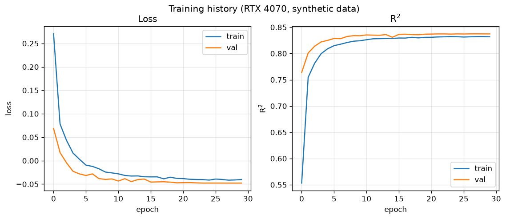
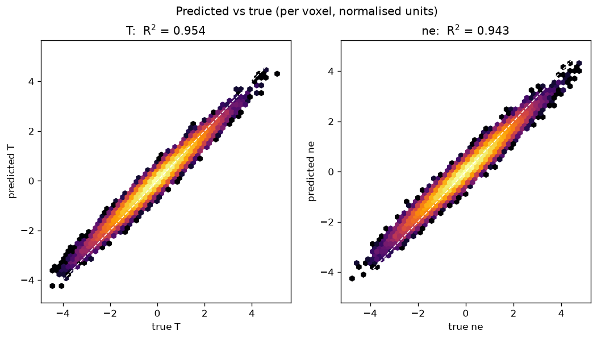
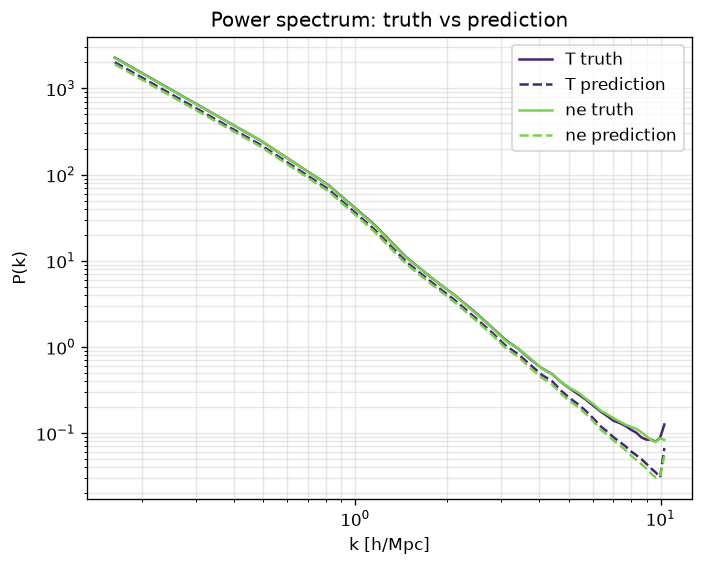
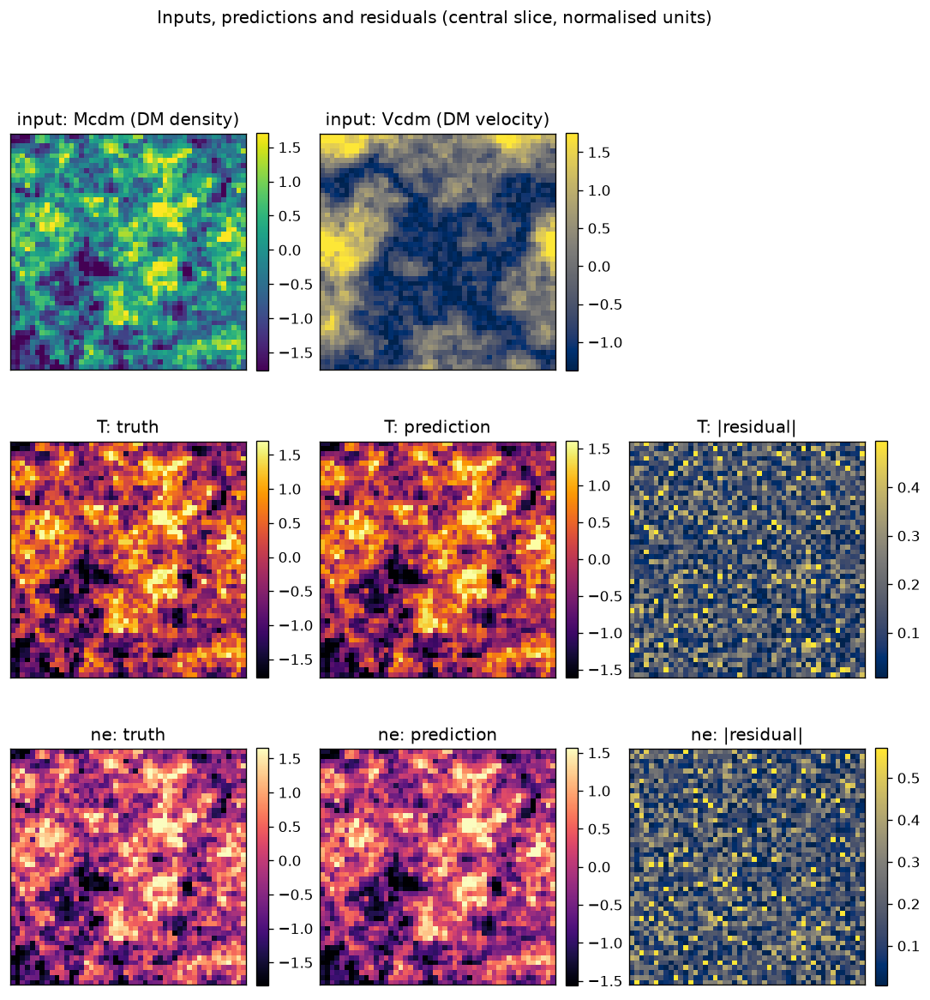
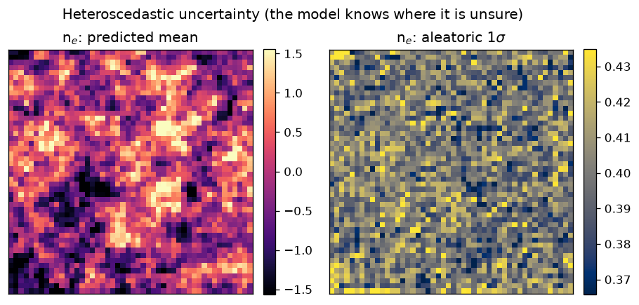
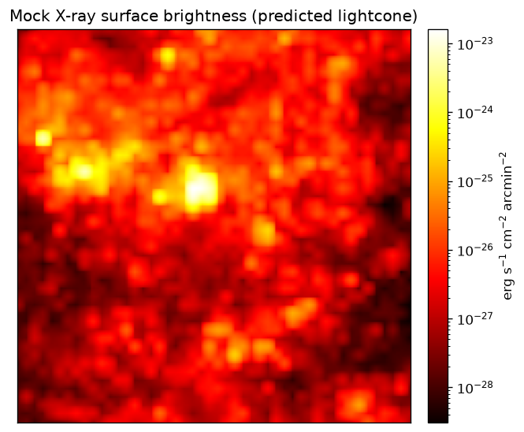

# CosmoMap

**3D deep learning for baryon prediction in galaxy clusters.**

CosmoMap is a 3D, FiLM-conditioned, *heteroscedastic* U-Net that maps the dark-matter
fields of a cosmological simulation (density + velocity) to the baryonic fields that
are expensive to simulate — **gas temperature** and **electron number density** — then
pushes those predictions through an **X-ray forward model** (emissivity →
surface-brightness lightcone). Trained on the
[CAMELS](https://camels.readthedocs.io/) IllustrisTNG suite and conditioned on the six
CAMELS cosmological/astrophysical parameters, a single network generalises across
cosmologies and feedback models — replacing ~10⁶ CPU-hour hydrodynamical simulations
with ~0.1 s of inference per volume.

My MSci dissertation project, University of Nottingham — *Enhancing Baryon Prediction
in Galaxy Clusters Through Three-Dimensional Deep Learning.*

```
   DM density  ┐
               ├─► [ 3D FiLM U-Net ] ─► (T, ne) means + per-voxel log-variance ─► X-ray emissivity ─► lightcone (FITS)
   DM velocity ┘            ▲
        Ω_m, σ₈, A_SN/AGN ──┘  (FiLM conditioning)
```

## Highlights

- **3D FiLM-conditioned U-Net** (~11M parameters) — residual encoder/decoder with
  GroupNorm; the six CAMELS parameters modulate every feature map via Feature-wise
  Linear Modulation, so one model spans the cosmological/astrophysical parameter space.
- **Uncertainty quantification** — heteroscedastic output head (aleatoric) plus
  Monte-Carlo dropout (epistemic), with calibrated confidence intervals.
- **Physics-informed composite loss** — Gaussian NLL + MSE + MAE + Huber, with a
  positivity prior on electron density and a variance regulariser.
- **X-ray forward model** — thermal-bremsstrahlung emissivity `ε_X = 1.42e-27·ne²·√T`,
  a flat-ΛCDM lightcone (angular-diameter mapping, PSF, background) written to FITS,
  plus 3D cluster detection and β-model surface-brightness fits.
- **Cosmological parameter recovery** — Random Forest on a 32-d feature vector
  (field moments + power-spectrum amplitudes + cluster morphology).
- **Engineered like a project, not a notebook** — typed, configurable (YAML),
  unit-tested, CI on every push, runnable end-to-end with one command.

## Results

| Quantity | Value |
|---|---:|
| Overall R² | **0.840** |
| Electron density (n_e) R² | 0.947 |
| Temperature R² | 0.733 |
| Temperature R²: void → cluster core | 0.548 → 0.796 |
| Density R²: void → cluster core | 0.627 → 0.835 |
| X-ray emissivity correlation | r = 0.963 ± 0.007 |
| 95% predictive-interval coverage | 94.2% |
| Cosmological parameter recovery (Ω_m, σ₈) R² | ≈ 0.64 |

Headline finding: accuracy *increases* in the densest regions (cluster cores), where
gravity dominates over stochastic feedback — the opposite of typical ML behaviour,
and exactly where accurate predictions matter most for X-ray cluster cosmology.

## Example outputs

Generated end-to-end by the pipeline (`scripts/make_figures.py`):



| Predicted vs. true (per voxel) | 3D power spectrum preserved |
|:---:|:---:|
|  |  |

Dark-matter inputs → predicted gas temperature and electron density (central slice):



| Heteroscedastic uncertainty | Mock X-ray lightcone |
|:---:|:---:|
|  |  |

## Quickstart

```bash
git clone https://github.com/amanbhutani1/CosmoMap.git
cd CosmoMap
pip install -e ".[dev]"

# Train on the built-in generator (no download needed)
cosmomap-train --config configs/synthetic.yaml --synthetic

# Evaluate (overall + density-stratified metrics + calibration)
cosmomap-evaluate --config outputs/synthetic/config.yaml \
                  --model outputs/synthetic/final_model.keras --synthetic

# Build a mock X-ray surface-brightness lightcone (FITS)
python scripts/make_lightcone.py --config outputs/synthetic/config.yaml \
                                 --model outputs/synthetic/final_model.keras --synthetic
```

Run the test suite:

```bash
pytest
```

## Training on real CAMELS data

See [`scripts/download_camels.md`](scripts/download_camels.md) for how to obtain and
arrange the IllustrisTNG-LH fields, then:

```bash
cosmomap-train --config configs/default.yaml
```

`configs/default.yaml` holds the full configuration: 80³ patches, a 3-level
`64→128→256` encoder, FiLM on the six parameters, heteroscedastic outputs, cosine
learning-rate decay, gradient clipping, and the tuned composite-loss weights.

## Repository layout

```
cosmomap/
  config.py            # typed, YAML-serialisable configuration
  data/
    normalization.py   # log + per-patch z-score (invertible)
    synthetic.py       # built-in CAMELS-like data generator
    camels.py          # real CAMELS loader
    dataset.py         # tf.data patch pipeline (simulation-level split)
  models/
    film.py            # FiLM layer
    blocks.py          # conditioning MLP + residual block
    unet3d.py          # 3D FiLM U-Net (heteroscedastic)
  losses.py            # composite NLL + MSE + MAE + Huber + physics
  metrics.py           # R², RMSE, PSNR, SSIM, power spectrum
  uncertainty.py       # MC-dropout + aleatoric/epistemic split
  validation.py        # scaling relations, cluster detection, β-model, Mahalanobis
  train.py             # training loop (CLI: cosmomap-train)
  evaluate.py          # density-stratified evaluation (CLI: cosmomap-evaluate)
  xray/
    emissivity.py      # bremsstrahlung emissivity
    lightcone.py       # lightcone forward model + FITS/WCS output
  inference.py         # cosmological-parameter recovery (Random Forest)
configs/               # default.yaml (full), gpu.yaml, synthetic.yaml (demo)
scripts/               # make_lightcone.py, make_figures.py, download_camels.md
tests/                 # unit + end-to-end tests
docs/METHOD.md         # method write-up: equation → code
```

## Method

See [`docs/METHOD.md`](docs/METHOD.md) for the full method write-up, mapping each
component (normalisation, FiLM conditioning, the composite loss, the X-ray forward
model, the validation suite) to its governing equation.

## License

[MIT](LICENSE) © 2025 Aman Bhutani
